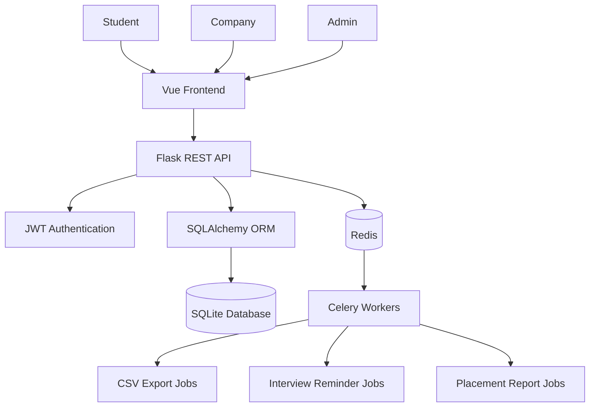
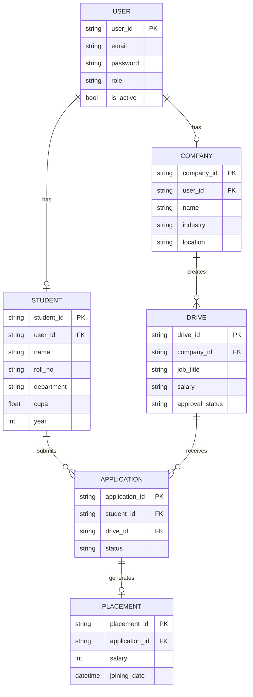
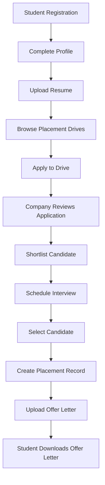

# Placement Portal Application

> Full-stack placement management platform built using Flask, Vue.js, Docker, Redis, and Celery.

## Overview

The Placement Portal Application is a web platform designed to streamline the campus placement process by connecting students, recruiters, and placement administrators through a unified system.

The platform provides role-based access for:

* Students
* Companies
* Placement Administrators

and supports the complete placement workflow from job posting to offer letter distribution.

**Note:** The source code repository is currently private due to academic evaluation requirements. It will be made public after project evaluation is completed.

---

## Key Features

### Student Portal

* Student registration and authentication
* Profile management
* Resume upload
* Browse and search placement drives
* Apply for job opportunities
* Track application status
* View interview schedules
* Download offer letters

### Company Portal

* Company registration
* Placement drive creation
* Applicant management
* Candidate shortlisting
* Interview scheduling
* Placement management
* Offer letter upload

### Admin Portal

* Company approval workflow
* Placement drive approval workflow
* Student and company management
* Search functionality
* User blacklisting/deactivation
* System-wide monitoring dashboard

---

## Technology Stack

### Backend

* Flask
* SQLAlchemy
* JWT Authentication
* SQLite

### Frontend

* Vue.js

### Infrastructure

* Docker
* Redis
* Celery

---

## System Architecture


## Database ER Diagram



## Placement Workflow



---

## Current Status

* Backend APIs implemented
* Authentication and RBAC completed
* Admin workflows completed
* Company workflows completed
* Student workflows completed
* Placement tracking completed
* Frontend currently under development
* Redis and Celery integration in progress

---

## Future Enhancements

* Redis caching
* Background task processing using Celery
* Automated interview reminders
* Placement analytics dashboard
* Resume screening (ATS)
* Cloud deployment

```
```
